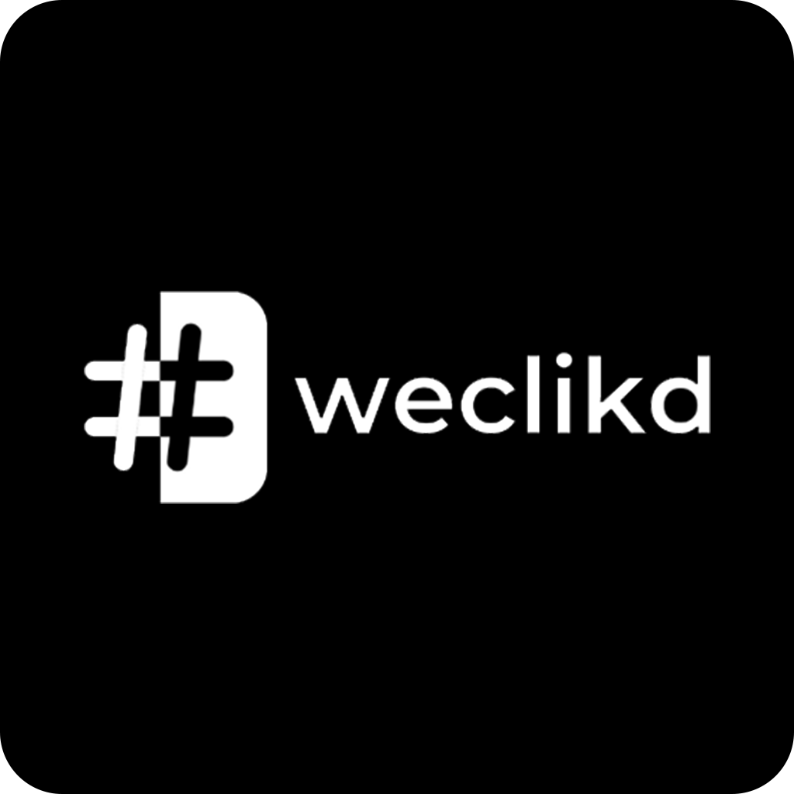

# Weclikd Inc. Frontend

The frontend application for [https://www.weclikd.com/](https://www.weclikd.com/). Fintech social media platform, ascribing value to the basic unit cost of idea.

This project connects to the [Weclikd API](https://github.com/weclikd/Janus).

## Getting Started

These instructions will get you a copy of the project up and running on your local machine for development and testing purposes. See running in production for notes on how to deploy the project on a live system.

## Prerequisites

What things you need to install the software and how to install them


| Location                                                     | Suggested Version       |
| -------------                                                |:-------------:|
| <a href="https://nodejs.org/en/">NodeJS</a>                     | >= 6.0.0 | 
| <a href="https://nodejs.org/en/">npm</a>                        | >= 4.0.0 | 


## Installing

```
npm install

```

## Running

**Development**

For Web Build

```
npm run devWebbuild

```

For Android Build

```
npm run devAndroidbuild

```

For IOS Build

```
npm run devIosbuild

```

**Staging**

For Web Build

```
npm run stagingWebbuild

```

For Android Build

```
npm run stagingAndroidbuild

```

For IOS Build

```
npm run stagingIosbuild

```

**Production**

For Web Build

```
npm run prodWebbuild

```

For Android Build

```
npm run prodAndroidbuild

```

For IOS Build

```
npm run prodIosbuild

```

**E2E Testing**

This project uses [Jestjs](https://jestjs.io/) for automated end to end testing with chromedriver.

```
npm run test

```

## Built With
- React Native Expo
- Webpack
- Node

# Contributing
We're always looking to improve this project, open source contribution is encouraged so long as they adhere to our guidelines.

# Pull Requests

The Solid State team will be monitoring for pull requests. When we get one, a member of team will test the work against our internal uses and sign off on the changes. From here, we'll either merge the pull request or provide feedback suggesting the next steps.

**A couple things to keep in mind:**

 - If you've changed APIs, update the documentation.
 - Keep the code style (indents, wrapping) consistent.
 - If your PR involves a lot of commits, squash them using ```git rebase -i``` as this makes it easier for us to review.
 - Keep lines under 80 characters.

## Getting Help

If you encounter a bug or feature request we would like to hear about it. Before you submit an issue please search existing issues in order to prevent duplicates. 

## Get in touch

If you have any questions about our projects you can email <a href="mailto:info@weclikd.com">info@weclikd.com</a>.

## Useful links

[Weclikd Development Website](https://electric-block-241402.appspot.com/)

[Weclikd Staging Website](https://www.weclikd-beta.com/)

[Weclikd Production Website](https://weclikd-prod.firebaseapp.com/)
